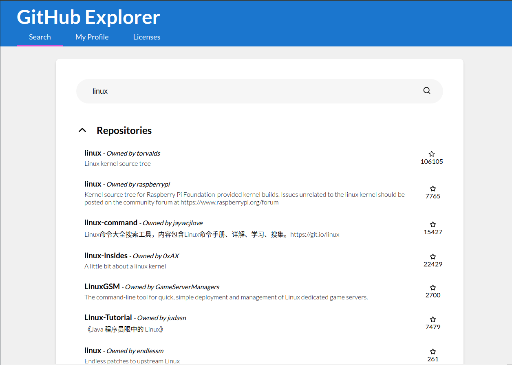
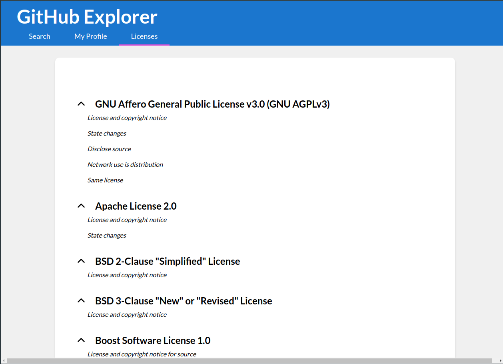

# GitHub Explorer

A simple interface to some of the most useful data provided by GitHub.

> Design based on Google's Material Design

> Developed using Next.js, ReactJS and Apollo

> Uses the GitHub GraphQL API

## Features

The website is based on three main functionalities, each one using a different approach to the data fetching.

### Search for Users and Repositories

The user may search for GitHub users and repositories, filtering by name.

As the search depends on user input, the query is sent on demand on `client-side`, by using a `Lazy Query`.




### See your Profile

The user is identified by the GitHub Access Token provided.

As there are no other parameters, the query is processed on `server-side`.


### See all Available Licenses

GitHub provides a list of open-source licenses that can be accessed through the API.

The list probably won't be changing regularly, so it's fetched on `build` and revalidated no more than once a minute, on `server-side`.



## How to Use

To use the application, create a `.env.local` file with the following content:

```js
API_KEY = '<your_github_access_token>'
```

Then, build and start the app, or open it in development mode

```shell
yarn build
yarn start

# or

yarn dev
```

## Build summary

```shell
Page                                                           Size     First Load JS
┌ ○ /                                                          2.27 kB         133 kB
├   /_app                                                      0 B             128 kB
├ ○ /404                                                       3.03 kB         131 kB
├ ● /licenses (ISR: 60 Seconds)                                521 B           131 kB
└ λ /myProfile                                                 1.65 kB         130 kB
+ First Load JS shared by all                                  128 kB
  └ (omitted)

λ  (Server)  server-side renders at runtime (uses getInitialProps or getServerSideProps)
○  (Static)  automatically rendered as static HTML (uses no initial props)
●  (SSG)     automatically generated as static HTML + JSON (uses getStaticProps)
   (ISR)     incremental static regeneration (uses revalidate in getStaticProps)
```
